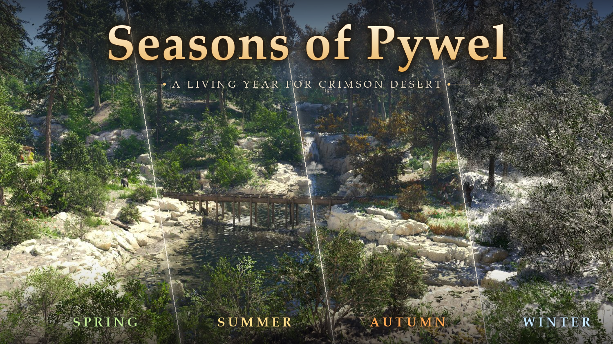

# Seasons of Pywel

Four seasons for **Crimson Desert** that follow the in-game calendar and change live while you play: autumn colours, spring greens, winter snow and cold, and weather, temperature and deep snow that follow the season. No game files are changed on disk.

Download and full description: Nexus Mods. The player readme is [release/README.txt](release/README.txt).

## Features

- **The year**: starts in summer; 30 in-game days a season by default (3, 7, 14, 45, 60 or 90 in the menu). Days 1-30 summer, 31-60 autumn, 61-90 winter, 91-120 spring.
- **Looks**: spring greens, autumn gold and orange (trees, bushes, grass, terrain, near and far), winter snow on the ground and on objects. Textures switch live.
- **Temperature**: summer +4, spring -6, autumn -8, winter -24 degrees against the game's own (deep snow up to 6 more); the desert stays warm in winter. Cold, not deadly: no season takes a night below -30 where the game's own nights are warmer, and the game's own cold places keep their temperatures.
- **Weather**: rain and snow spells rolled per season on the game's clock (winter snows often, autumn rains often, spring some, summer rarely), clouds with them, the game's own rain turned to snow in winter and mostly kept away in summer. Sleeping and waiting move it on.
- **Deep snow**: builds up while it snows, spreads from the coldest places, melts after a dry spell or when winter ends; can be turned off. Each loaded save gets back the depth it had at its in-game day and hour.
- **Control Menu (F5)**: season by the day or fixed, season length, deep snow on or off, the weather and the snow depth. Testing rows for videos (weather, temperature, snow depth, calendar) with `[Testing] ControlMenu = 1` in `bin64\Seasons.ini`.

## How it works

`Seasons.asi` is an ASI plugin (x64, MinHook):

- **archive.cpp**: serves each season's textures from `bin64\Seasons\data` while the game runs. It patches the game's file index (`0.pamt`), texture size table (`meta/0.pathc`) and group list (`meta/0.papgt`) as they are read, and again in memory on a season change. The season data sits in regions past the end of the game's archives.
- **gpu.cpp**: textures the game keeps loaded (far trees, the climate texture's snow cover) are recognised by their mips' first bytes in the game's D3D12 uploads and re-uploaded on a season change.
- **climate.cpp**: the game's CPU climate maps (temperature, day-to-night range, wind) get the season's values, live, with a floor for the nights; the deep snow line moves with the season and the snow depth.
- **weather.cpp**: hooks the climate manager's update, after it composes the weather layers, and writes the season's rain, snow, clouds and humidity. It also reads the game's clock and the HUD's weather, plays slept time through, and keeps the snow depth by the game's time for loaded saves.
- **menu.cpp / overlay.cpp**: the F5 Control Menu (Direct2D over the game's D3D12 swap chain, HDR aware, ReShade aware).

[docs/research-notes.md](docs/research-notes.md) has the findings (addresses, data layouts, what was tried).

## Building

- **Plugin**: Visual Studio 2026 (toolset v145), `msbuild asi/Seasons.vcxproj -p:Configuration=Release -p:Platform=x64`; output `asi/bin/Seasons.asi`.
- **Season data**: made from your own copy of the game (no game assets are in this repository). `tools/game_files.py` reads the game's archives through [Crimson Browser Sharp](https://www.nexusmods.com/crimsondesert)'s archive index; `tools/autumn_tint.py`, `autumn_plants.py`, `autumn_tiles.py`, `autumn_ground.py` and `climate_dds.py` make the season textures; `tools/build_season_data.py` packs them as the game packs its own (`tools/lz4pad.py`); `tools/make_release.py` builds the zip. Python 3 with numpy, lz4 and Pillow.
- The other scripts in `tools/` are research tools (disassembly, memory reading) used while finding how the game works.

## Credits

- [MinHook](https://github.com/TsudaKageyu/minhook) by Tsuda Kageyu (see `release/THIRD_PARTY.txt`).
- The hook points for the composed weather (rain, snow and the compose step) were found with the help of the hook list of the Crimson Weather mod.
